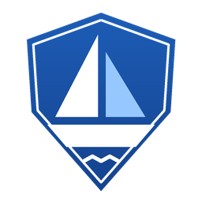

<p align="center">
  
</p>

<h1 align="center">SailHighSea Firewall</h1>

<p align="center">
  A tiny, open-source Windows firewall for choosing which apps may go online.<br />
  One small <code>.exe</code> (about 360 KB), no installer, no runtime, portable.
</p>

<p align="center">
  <a href="LICENSE"></a>
  
  
</p>

## What is SailHighSea Firewall?

SailHighSea Firewall is a small firewall front end for Windows in the spirit of
[simplewall](https://github.com/henrypp/simplewall). It talks directly to the
**Windows Filtering Platform (WFP)**, the engine Windows Defender Firewall itself is built on, and
does one job: **decide which applications may access the network**.

Click **Enable Filters** and everything is blocked except the apps you have allowed. When
something gets blocked, a small pop-up offers to allow it, for good or for a limited time.

> **Status:** early development (v0.0.x). Expect rough edges and please test on a non-critical
> machine first. A default-deny firewall that is missing a rule can cut you off from the network;
> **Disable Filters** always puts everything back.

## Features

- **Default-deny, outbound.** One button switches the block-all filter on or off. Filters can be
  *permanent* (kept after a reboot) or *until reboot* (the safest choice while testing).
- **Per-application allow list.** One rule covers IPv4 and IPv6 for an executable.
- **Timed allow.** Right-click an app and allow it for 15 / 30 minutes or 1 / 2 / 4 / 8 hours. The
  row turns amber with the time left, and the app is blocked again when it runs out.
- **Block pop-up.** A card with **Allow**, a split **15 min ▾** button and **Ignore**, a
  countdown, and a **Notifications** switch to turn pop-ups off.
- **DNS switch.** The toolbar button turns your chosen DNS on (green, with the service name) or
  back to automatic. Presets: Cloudflare, Google, Quad9, OpenDNS, AdGuard, plus your own entries
  (IPv4 or IPv6). The status bar shows the active DNS too. VPN adapters are left alone.
- **Clear list.** App icons, sortable columns, status dot, search box, highlighting for allowed,
  blocked, timed, running, Windows and invalid (missing file) entries, and a hover highlight.
- **Dark, light or follow Windows** (the default), with a matching title bar. Sharp on high-DPI and
  multi-monitor setups.
- **Notification-area icon.** Left-click shows or hides the window; the right-click menu has the
  same Options.
- **Options.** Start with Windows (an elevated scheduled task, no UAC prompt), start minimized,
  close / minimize to tray, always on top, allow DNS (port 53), keep filters after reboot, disable
  filters on exit, hide Windows system apps, show only running apps.
- **Housekeeping.** *Refresh list* (**F5**) and *Purge invalid entries* (removes rules whose
  program no longer exists).
- **Portable.** Settings and lists live next to the `.exe`, so copy the folder anywhere.
- **Its own WFP footprint.** A dedicated WFP provider and sublayer keep everything the app creates
  apart from Windows Firewall's own rules. Leftover filters from older versions are cleaned up.
- **Bug-report log.** `debug-log.txt` next to the `.exe` records what happened (see below).

## Download

Get the latest `SailHighSea-Firewall-native-<version>-win-x64.exe` (or the `.zip`) from the
[Releases](../../releases) page. Builds from the `dev` branch are marked *Pre-release*.

| | |
|---|---|
| **To run** | Windows 10 / 11, 64-bit, and administrator rights (a UAC prompt on launch). |

## Using it

1. Start the app (it asks for administrator rights). The window shows **Filters OFF**.
2. Allow the apps you want online: select a row and click **Allow App**, double-click it, or use
   **Add App...** to browse for an `.exe`. Browsers, mail clients and similar are the usual first picks.
3. Click **Enable Filters** and choose *Permanent* or *Until reboot*.
4. Anything else is blocked. If notifications are on, a pop-up offers to allow it.
5. **Disable Filters** removes the block-all rules at any time; your allow list is kept.

Closing the window does **not** switch filtering off; the rules live in the Windows filtering
engine (turn on *Disable filters when exiting* if you want that). Windows services run inside
`svchost.exe`, so features such as Windows Update or time sync need `svchost.exe` allowed, just as
in simplewall.

### Files next to the exe

| File | What it is |
|---|---|
| `allowed-apps.txt` | Your allow list (with expiry times for timed rules) |
| `blocked-apps.txt` | Apps you marked as blocked |
| `settings.ini` | Options, theme, window position and DNS presets |
| `debug-log.txt` | Log for bug reports (renamed to `debug-log.old.txt` at about 1 MB) |

## Building from source

The app is plain C against the Win32 API and the WFP headers. It is cross-compiled with
[mingw-w64](https://www.mingw-w64.org/):

```bash
# Linux, WSL or macOS with mingw-w64 installed
cd native
./build.sh                    # produces SailHighSea-Firewall.exe
./build.sh 0.0.1 0.0.1-dev.1  # numeric version, and the text shown in the title bar
```

On Windows, install [MSYS2](https://www.msys2.org/), then in a *MINGW64* shell:

```bash
pacman -S mingw-w64-x86_64-gcc
cd native
CC=gcc WINDRES=windres ./build.sh
```

Run the result from an **elevated** prompt or just double-click it (the manifest asks for
administrator rights).

### Releases

Every push to `main` or `dev` runs
[`.github/workflows/build-release.yml`](.github/workflows/build-release.yml). It builds the app,
creates the next version tag and publishes a GitHub release with the `.exe` and a `.zip`:
`main` makes a stable release (`v0.0.1`, `v0.0.2`, ...) and `dev` makes a pre-release
(`v0.0.1-dev.1`, `v0.0.1-dev.2`, ...). Pushes that only touch Markdown, `LICENSE` or `.gitignore`
are skipped.

## How it works

1. A WFP session is opened with `FwpmEngineOpen0`.
2. The provider and sublayer are created if they do not exist yet.
3. **Enable Filters** adds, in one transaction and on both `ALE_AUTH_CONNECT_V4` and `..._V6`:
   permits for each allowed application (matched on its application ID), permits for loopback,
   DHCP and (optionally) DNS, and a lowest-weight block-all filter, added last.
4. **Allowing an app** resolves its WFP application ID (`FwpmGetAppIdFromFileName0`) and adds a
   permit filter pair (IPv4 + IPv6). The rule is identified by one GUID: the IPv4 filter key is
   the rule key and the IPv6 key is derived from it.
5. Dropped connections raise WFP *net events*. The app subscribes with `FwpmNetEventSubscribe0`,
   keeps only drops caused by its own block-all filter, and turns them into the pop-up.
6. The **DNS switch** sets the DNS servers of connected physical adapters through PowerShell
   (`Set-DnsClientServerAddress`). It is separate from the filters.

### Repository layout

| Path | Description |
|---|---|
| `native/main.c` | The whole application |
| `native/build.sh` | mingw-w64 build script |
| `native/app.rc`, `app.manifest`, `app.ico` | Resources: version info, administrator manifest, icon |
| `assets/icon.png` | Icon used in this README |
| `legacy-dotnet/` | The original .NET / WPF prototype, kept for reference (not released) |
| `.github/workflows/build-release.yml` | CI build, automatic tagging and releases |

## Troubleshooting

- **Internet is gone and the app will not start.** Run
  `SailHighSea-Firewall.exe --disable-filters` from an administrator prompt. It removes the
  block-all filters and exits without opening the window. Filters enabled in *until reboot*
  mode also disappear on restart, so prefer that mode while testing a new build.
- **Reporting a bug.** Open **Options > Open debug log** (or the file `debug-log.txt` next to the
  `.exe`) and attach it to your GitHub issue. It records start-up, enabling and disabling
  filters, allow / block actions, errors and crash details. Only program *file names* are logged,
  never full paths or IP addresses, but please glance through it before sharing.
- **A name lookup fails.** Check that *Allow DNS (port 53)* is on while filters are enabled. Browsers
  using their own encrypted DNS (DNS over HTTPS) ignore the Windows DNS setting.

## Current limitations

- **Outbound only.** Inbound connections (`ALE_AUTH_RECV_ACCEPT`) are not filtered; Windows
  Firewall still handles those.
- **Executable paths only.** Microsoft Store (packaged) apps and individual Windows services
  need package / service SID conditions, which are not implemented.
- **Pop-ups are best effort.** They are built from WFP drop events, so an application can
  occasionally trigger one for a connection that is not a normal outbound attempt.
- No connection log or per-port / per-address rules yet.
- 64-bit Windows only.

## Contributing

Issues and pull requests are welcome. Please open an issue first for larger changes. Since the
app manipulates the system firewall, test every change on a machine or VM where you can afford
to lose network access.

## License

SailHighSea Firewall is released under the **MIT License**.

Copyright (c) 2026 SailHighSea Firewall contributors. See the [LICENSE](LICENSE) file for the full text.
